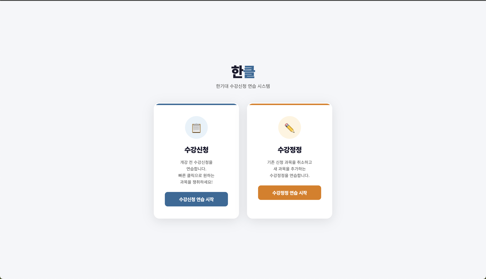
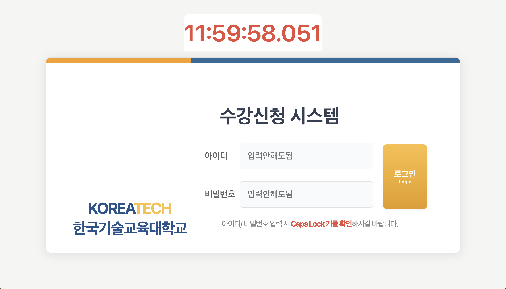
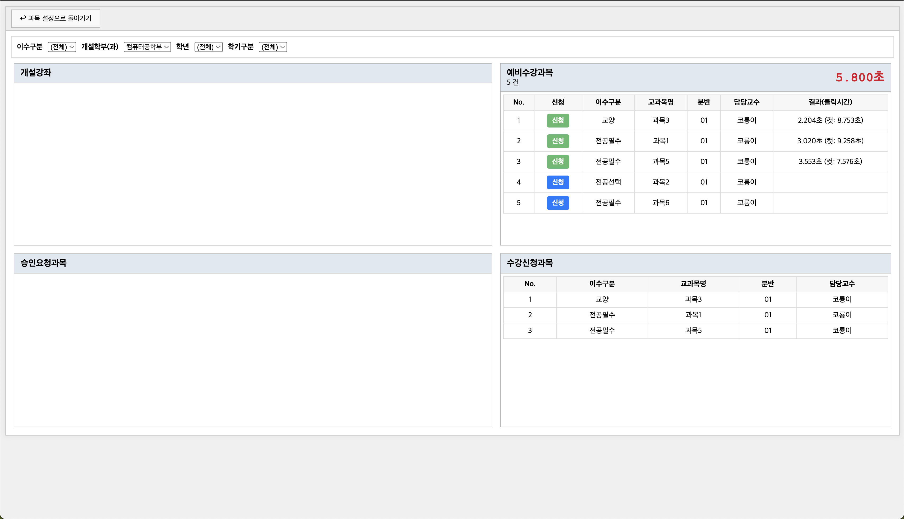
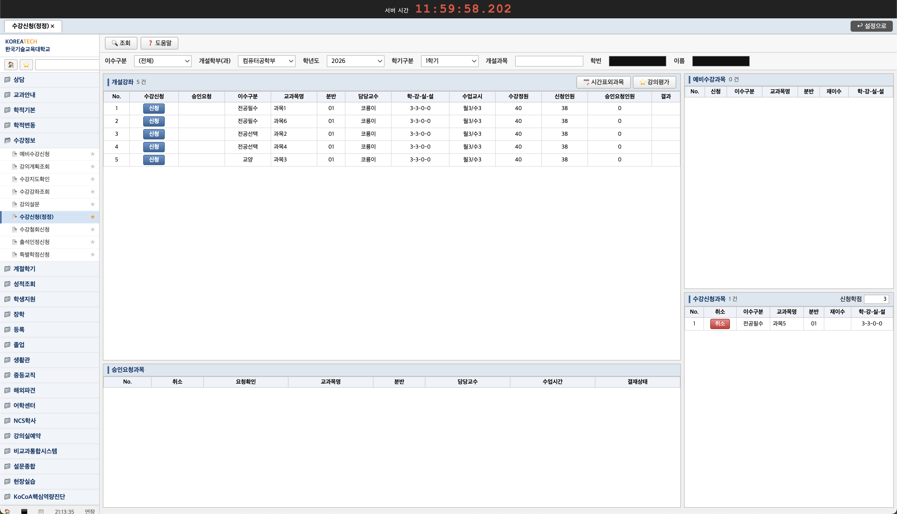

# 한기대 수강신청 연습 사이트

## 프로젝트 소개

**한클(한기대 올클)은 한국기술교육대학교 수강신청 상황을 미리 연습할 수 있도록 만든 모의 수강신청 웹 사이트입니다.**

실제 수강신청처럼 서버 시간, 로그인 화면, 과목 설정, 신청 버튼, 정원 초과 판정, 수강정정 흐름을 구성하여 사용자가 수강신청 전에 클릭 타이밍과 화면 흐름을 익힐 수 있도록 제작했습니다.

> 본 프로젝트는 수강신청 연습을 위한 모의 사이트이며, 실제 수강신청 시스템과는 무관합니다.

## 사용 사진






## 주요 기능

- 수강신청 / 수강정정 모드 선택
- 연습할 과목 개수 설정
- 난이도 선택
- 가상 서버 시간 표시
- 12시 정각 이후 로그인 가능 처리
- 과목별 랜덤 컷타임 기반 신청 성공 / 실패 판정
- 신청 성공 과목 목록 표시
- 수강정정 모드에서 기존 신청 과목 취소 및 새 과목 추가
- 연습 종료 후 결과 확인
- Cloudflare Web Analytics를 통한 방문 통계 수집

## 사용 기술

| 분류      | 기술                     |
| --------- | ------------------------ |
| Markup    | HTML5                    |
| Styling   | CSS                      |
| Logic     | JavaScript               |
| Analytics | Cloudflare Web Analytics |

이 프로젝트는 별도의 프레임워크 없이 HTML, CSS, JavaScript만으로 구성된 정적 웹 프로젝트입니다.

github pages를 통해 배포되었습니다.

## 실행 방법

별도의 설치나 빌드 과정 없이 [한클](https://dldb-chamchi.github.io/koreatech-sugang-practice/index.html)에서 연습할 수 있습니다.

## 프로젝트 기여 법

```bash
git clone 저장소_URL
```

branch를 만들어 추가하고 싶은 기능을 만든 후 main으로 PR을 올립니다.

## 전체 페이지 흐름

### 수강신청 모드

```text
index.html
→ modeSelect.html
→ setting.html
→ login.html
→ sugangPractice.html
```

1. `index.html`에서 모의 사이트 안내 및 주의 문구를 확인합니다.
2. `modeSelect.html`에서 수강신청 모드를 선택합니다.
3. `setting.html`에서 연습할 과목 개수와 난이도를 설정합니다.
4. `login.html`에서 가상 서버 시간이 12시가 된 후 로그인합니다.
5. `sugangPractice.html`에서 과목별 신청 버튼을 눌러 연습을 진행합니다.

### 수강정정 모드

```text
index.html
→ modeSelect.html
→ setting.html
→ jeongjungPractice.html
```

1. `modeSelect.html`에서 수강정정 모드를 선택합니다.
2. `setting.html`에서 과목 개수와 난이도를 설정합니다.
3. 기존 신청 과목 일부가 자동으로 수강신청과목 목록에 표시됩니다.
4. `jeongjungPractice.html`에서 기존 과목을 취소하거나 새 과목을 신청합니다.
5. 모든 신청을 마치면 수강정정 결과를 확인할 수 있습니다.

## 파일 구조

```text
.
├── README.md
├── index.html              # 첫 안내 화면
├── modeSelect.html         # 수강신청 / 수강정정 모드 선택 화면
├── setting.html            # 과목 개수 및 난이도 설정 화면
├── login.html              # 수강신청 로그인 화면
├── sugangPractice.html     # 수강신청 연습 화면
├── jeongjungPractice.html  # 수강정정 연습 화면
├── setting.js              # 과목/난이도 설정 및 페이지 이동 처리
├── login.js                # 가상 서버 시간 및 로그인 가능 여부 처리
├── script.js               # 수강신청 연습 핵심 로직
├── style.css               # 로그인 화면 스타일
└── sugang.css              # 설정 및 수강신청 화면 공통 스타일
```

## 주요 동작 방식

### 1. 모드 선택

- `sugang`: 로그인 화면을 거쳐 수강신청 연습 화면으로 이동
- `jeongjung`: 로그인 없이 수강정정 연습 화면으로 이동

### 2. 과목 및 난이도 설정

`setting.js`에서는 미리 정의된 과목 목록에서 사용자가 선택한 개수만큼 과목을 랜덤으로 뽑습니다.

### 3. 가상 서버 시간

`login.js`에서는 실제 현재 시간이 아니라 가상의 서버 시간을 표시합니다.

처음에는 `11:59:55.000`부터 시작하며, 5초가 지나면 12시가 된 것으로 처리합니다.

### 4. 신청 성공 / 실패 판정

### 5. 수강정정 모드

수강정정 모드에서는 기존 신청 과목이 먼저 표시됩니다.
사용자는 기존 과목을 취소하거나 새 과목을 신청할 수 있습니다.

신청 성공, 신청 실패, 취소 내역은 마지막 결과 모달에서 확인할 수 있습니다.

## 난이도 기준

현재 코드상 난이도별 컷타임은 다음과 같이 설정되어 있습니다.

| 난이도 | 컷타임 범위 |
| ------ | ----------- |
| Easy   | 10 ~ 20초   |
| Normal | 5 ~ 10초    |
| Hard   | 3 ~ 5초     |

컷타임은 과목마다 랜덤으로 생성되며, 사용자가 해당 시간 안에 신청 버튼을 누르면 성공으로 처리됩니다.

## 주의 사항

이 사이트는 수강신청 연습을 위한 개인 프로젝트입니다.
실제 한국기술교육대학교 수강신청 시스템과 연결되어 있지 않으며, 실제 수강신청 기능을 제공하지 않습니다.
